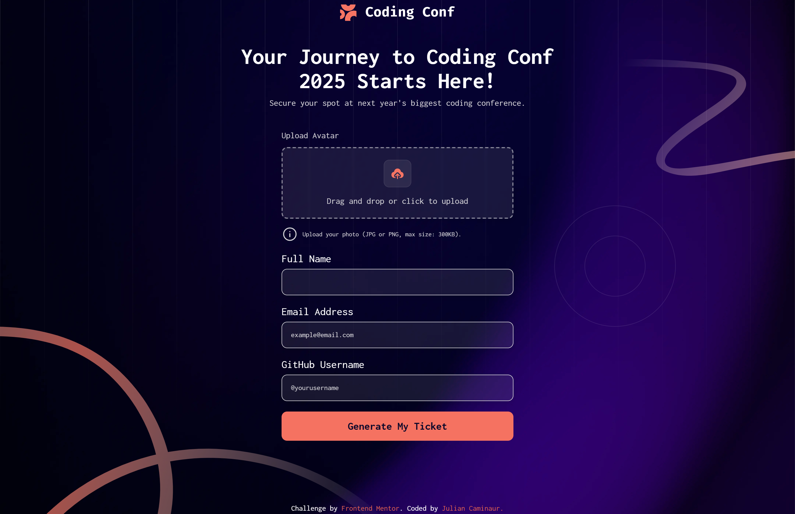
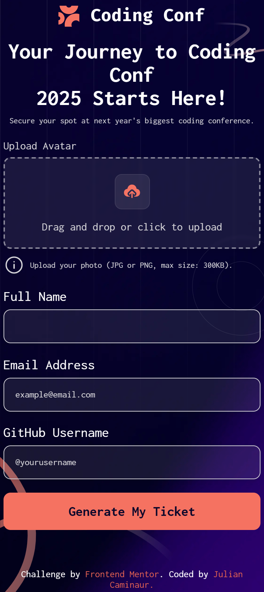

# Frontend Mentor - Conference ticket generator solution

This is a solution to the [Conference ticket generator challenge on Frontend Mentor](https://www.frontendmentor.io/challenges/conference-ticket-generator-oq5gFIU12w).

## Table of contents

- [Overview](#overview)
  - [The challenge](#the-challenge)
  - [My Solution](#my-solution)
    - [Desktop](#desktop)
    - [Mobile](#mobile)
  - [Links](#links)
- [My process](#my-process)
  - [Built with](#built-with)
  - [Useful resources](#useful-resources)
- [Author](#author)

**Note: Delete this note and update the table of contents based on what sections you keep.**

## Overview

### The challenge

Users should be able to:

- Complete the form with their details
- Receive form validation messages if:
  - Any field is missed
  - The email address is not formatted correctly
  - The avatar upload is too big or the wrong image format
- Complete the form only using their keyboard
- Have inputs, form field hints, and error messages announced on their screen reader
- See the generated conference ticket when they successfully submit the form
- View the optimal layout for the interface depending on their device's screen size
- See hover and focus states for all interactive elements on the page

### My Solution

#### Desktop

#### Mobile

### Links

- Live Site URL: [Live Site](https://caminaur-conference-ticket.netlify.app/)
- Solution Repository: [Github](https://github.com/Caminaur/conference-ticket-generator)

## My process

### Built with

- React JS
- Semantic HTML5 markup
- CSS custom properties
- Flexbox

### Useful resources

- [React](https://react.dev/reference/react)

## Author

- [Website](https://julian-caminaur.tech/)
- [Frontend Mentor](https://www.frontendmentor.io/profile/Caminaur)
- [CSS Battle](https://cssbattle.dev/player/caminaur)
- [Exercism](https://exercism.org/profiles/Caminaur)
